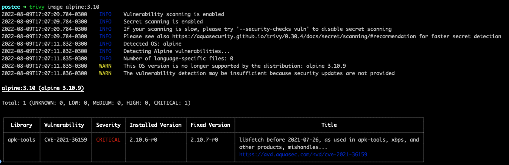

# Demo using Trivy and Postee

Receive a notification if you find critical vulnerabilities when you build your image.

[GIF DEMO]

## Trivy Image vulnerability

`trivy image alpine:3.10`



## Integrate Trivy with Github action

[Sample pipeline](./.github/workflows/trivy-postee.yml) to validate the image vulnerabilities and notify to slack the results.

1. Run trivy using [trivy-action](https://github.com/aquasecurity/trivy-action)
2. Send the trivy results to [Postee](https://github.com/aquasecurity/postee)

### Settings in the pipeline

Configure a Secret environment `${{ secrets.POSTEE_SERVER }}` for your Postee endpoint. More details to create secrets in github here.

<details>
<summary>Show</summary>


</details></br>

>> Postee webhook `http://postee-svc.default.svc.cluster.local:8082`

### Install Postee

```
kubectl create -f https://raw.githubusercontent.com/aquasecurity/postee/main/deploy/kubernetes/postee.yaml

```
[Postee manifest to install](https://aquasecurity.github.io/postee/v2.7.2/install/)

### Trivy and Postee demo

