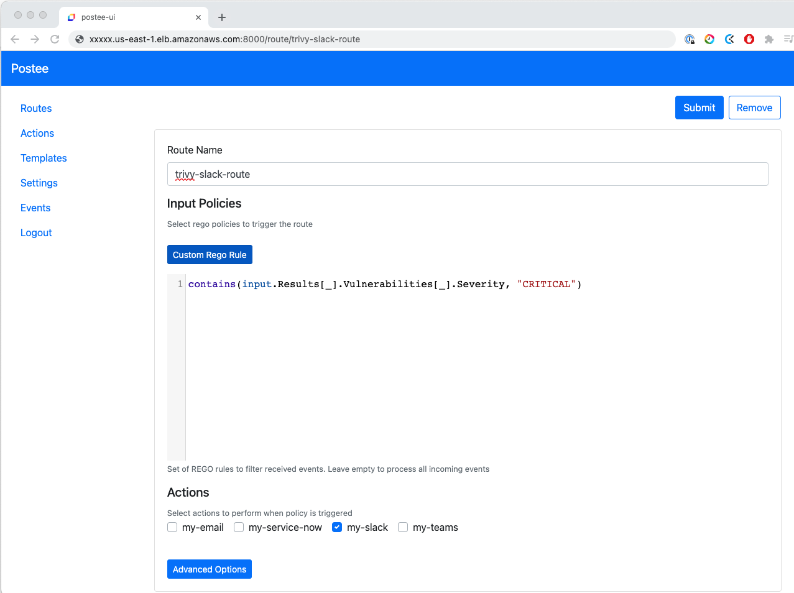
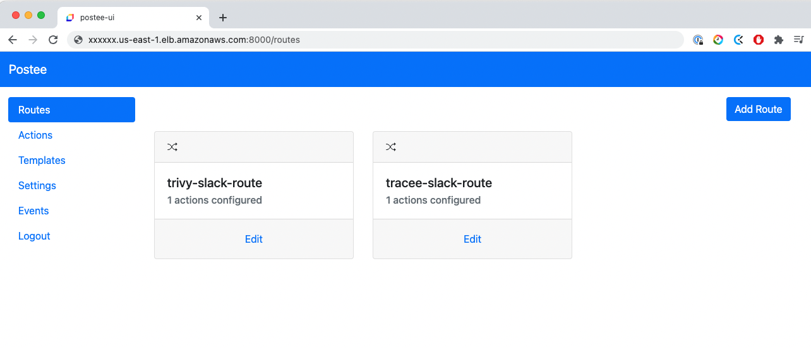
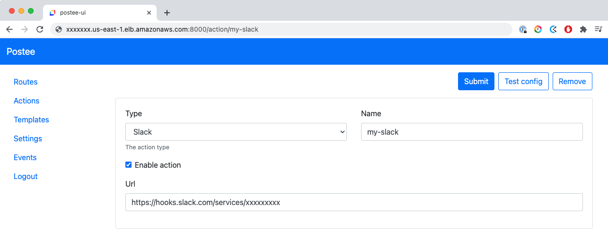

# Demo using Trivy and Postee

Receive a notification if you find critical vulnerabilities when you build your image, ath the build stage.


## Trivy Image vulnerability

`trivy image alpine:3.10`


## Integrate Trivy with Github action

[Sample pipeline](./.github/workflows/trivy-postee.yml) to validate the image vulnerabilities and notify to slack the results.

1. Run trivy using [trivy-action](https://github.com/aquasecurity/trivy-action)
2. Send the trivy results to [Postee](https://github.com/aquasecurity/postee)

### Settings in the pipeline

Configure a Secret environment `${{ secrets.POSTEE_SERVER }}` for your Postee endpoint.

>> Postee webhook `http://postee-svc.default.svc.cluster.local:8082`

### Install Postee

```
kubectl create -f https://raw.githubusercontent.com/aquasecurity/postee/main/deploy/kubernetes/postee.yaml

```
>> [Postee documentation](https://aquasecurity.github.io/postee/v2.7.2/install/)

### Trivy and Postee demo

Postee-UI (User Interface) will help you to configure the [cfg.yml](https://github.com/aquasecurity/postee/blob/main/cfg.yaml).

Postee receive an input (JSON), and it will use filters written in [OPA](https://www.openpolicyagent.org/docs/v0.11.0/get-started/) to analyze the data and send output to other third parties like slack.

You can configure several routes acording the policies to apply to the input.




<details>
<summary>Show the routes</summary>


</details></br>

<details>
<summary>Show the slack settings</summary>


</details></br>